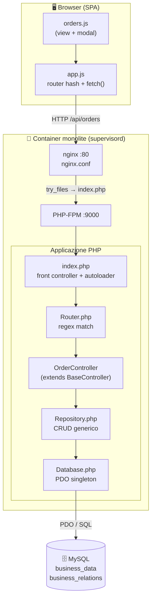
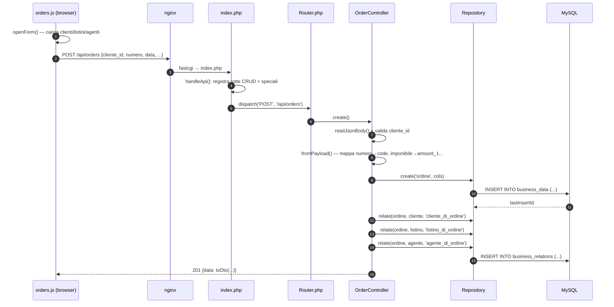

# Architettura & flusso di una richiesta di Ordine

Soluzione `phase-01-monolith`. Tracciamento di una richiesta di ordine dal browser
fino al database, attraverso tutti i layer del monolite PHP.

---

## 1. Architettura a runtime (componenti)



**Punto chiave didattico:** non esistono tabelle `orders`/`order_lines`. Tutto passa per due
tabelle generiche EAV-like ([schema.sql](../phase-01-monolith/database/schema.sql)):

- `business_data` — colonne anonime `amount_1..4`, `text_1..5`, `date_1..3`, `status`, `payload_json`. Il significato dipende da `record_type` (`ordine`, `riga_ordine`, `articolo`, ...).
- `business_relations` — collegamenti `source_id → target_id` tipizzati (`cliente_di_ordine`, `articolo_in_riga_ordine`, ...).

La conoscenza di "cosa significa `amount_1` per un ordine" vive solo nei Controller → è l'anti-pattern
che la modernizzazione vuole rendere esplicito.

---

## 2. Flusso: creazione ordine — `POST /api/orders`



### Mappa codice (con riferimenti)

| # | Layer | File | Cosa succede |
|---|---|---|---|
| 1 | Frontend | [orders.js:55-60](../phase-01-monolith/php-app/public/js/orders.js#L55-L60) | `Salva` → `M.post('/api/orders', v)` |
| 2 | Fetch wrapper | [app.js:19-46](../phase-01-monolith/php-app/public/js/app.js#L19-L46) | `api('POST', url, body)` con header JSON + toast su errore |
| 3 | Web server | [nginx.conf:25-34](../phase-01-monolith/nginx.conf#L25-L34) | `try_files $uri /index.php` → FastCGI a PHP-FPM |
| 4 | Front controller | [index.php:67-69](../phase-01-monolith/php-app/index.php#L67-L69) | rileva prefisso `/api/` → `handleApi()` |
| 5 | Registrazione rotte | [index.php:91-119](../phase-01-monolith/php-app/index.php#L91-L119) | helper `$crud()` registra i 5 verbi; `OrderController` su `/api/orders` |
| 6 | Router | [Router.php:36-54](../phase-01-monolith/php-app/src/Router.php#L36-L54) | match regex → invoca handler → ritorna `[status, body]` |
| 7 | Controller | [OrderController.php:67-82](../phase-01-monolith/php-app/src/Controllers/OrderController.php#L67-L82) | `create()` override: valida, `fromPayload()`, crea + 3 relazioni |
| 8 | Repository | [Repository.php:105-135](../phase-01-monolith/php-app/src/Repository.php#L105-L135) | `create()` costruisce INSERT su colonne whitelisted + `payload_json` |
| 9 | Relazioni | [Repository.php:178-193](../phase-01-monolith/php-app/src/Repository.php#L178-L193) | `relate()` → INSERT in `business_relations` |
| 10 | DB | [Database.php:16-48](../phase-01-monolith/php-app/src/Database.php#L16-L48) | PDO singleton (retry su cold start) |

---

## 3. Flusso "interessante": aggiunta riga — `POST /api/orders/:id/righe`

Qui vive la logica di business (calcolo IVA, sconto riga, ricalcolo totali ordine).

```mermaid
sequenceDiagram
    autonumber
    participant U as orders.js
    participant C as OrderController.addRiga()
    participant Repo as Repository
    participant DB as MySQL

    U->>C: POST /righe {articolo_id, qta, prezzo, sconto}
    C->>Repo: findById(articolo) — prezzo fallback se 0
    C->>C: imponibile = qta*prezzo*(1-sconto/100)
    C->>Repo: rawOne() lookup % IVA (record_type=aliquota_iva)
    C->>C: iva = imp*%/100 ; totale = imp+iva
    C->>Repo: create('riga_ordine', {parent_id=ordine, amount_*})
    C->>Repo: relate(riga, articolo, 'articolo_in_riga_ordine', qta)
    C->>Repo: relate(riga, iva, 'iva_di_riga')
    C->>C: recalcOrdine(id)
    C->>Repo: rawAll() somma imponibili/iva delle righe
    C->>Repo: update(ordine, amount_1/2/3) — applica sconto globale
    C-->>U: 201 {riga calcolata}
```

### Punti di codice notevoli

- Calcolo importi riga: [OrderController.php:135-144](../phase-01-monolith/php-app/src/Controllers/OrderController.php#L135-L144)
- Lookup aliquota IVA via query raw (no FK): [OrderController.php:138-142](../phase-01-monolith/php-app/src/Controllers/OrderController.php#L138-L142)
- Righe come `record_type='riga_ordine'` con `parent_id`/`parent_type` (gerarchia simulata): [OrderController.php:154-165](../phase-01-monolith/php-app/src/Controllers/OrderController.php#L154-L165)
- Ricalcolo totali ordine: [OrderController.php:178-199](../phase-01-monolith/php-app/src/Controllers/OrderController.php#L178-L199)
- Generazione fattura da ordine (frontend, importi "magici" 82/18): [orders.js:139-153](../phase-01-monolith/php-app/public/js/orders.js#L139-L153)

---

## 4. Lettura dettaglio — `GET /api/orders/:id` e `/righe`

- `OrderController::toDto()` ricostruisce cliente/listino/agente con 3 query separate su
  `business_relations` ([OrderController.php:12-37](../phase-01-monolith/php-app/src/Controllers/OrderController.php#L12-L37)) → **N+1 query** per riga di lista.
- `righe()` fa una query per le righe + 1 query per articolo per ogni riga
  ([OrderController.php:85-118](../phase-01-monolith/php-app/src/Controllers/OrderController.php#L85-L118)).

> Questi due punti (modello EAV generico + N+1 sulle relazioni) sono i candidati naturali
> per il refactoring verso un bounded context `Ordini` con tabelle dedicate.
