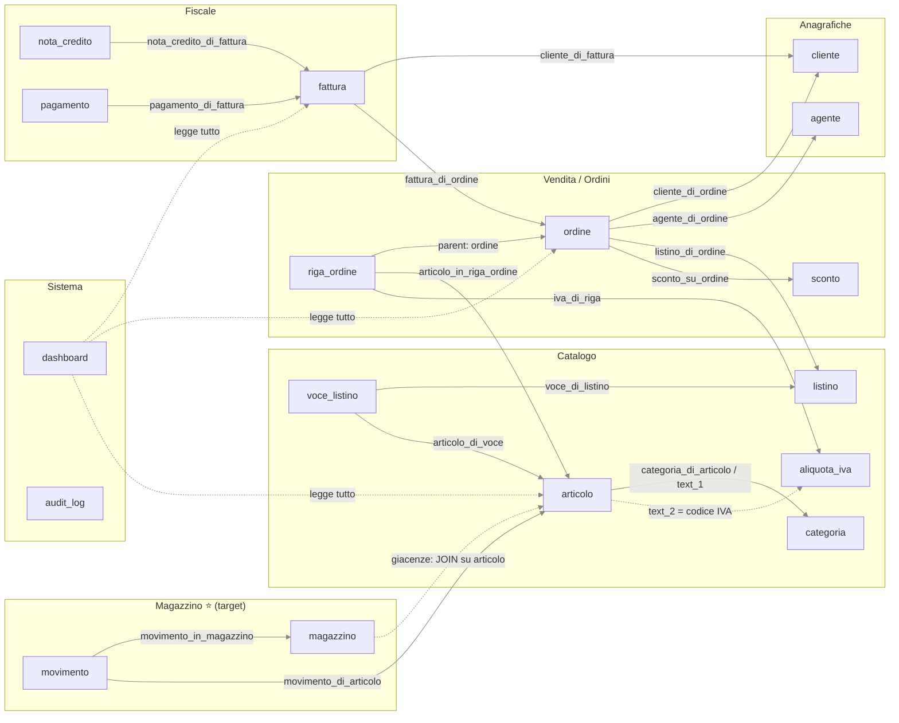

# Coupling Map — MIC (soluzione `phase-01-monolith`)

Come sono **realmente** salvati i dati di business e quali parti del dominio leggono/scrivono i
dati delle altre. Nomina gli accoppiamenti che una futura estrazione (BC **Warehouse**) dovrà
spezzare. Ogni accoppiamento ha l'evidenza nel codice/schema.

---

## 0. L'accoppiamento radice: storage condiviso

Non esistono tabelle per dominio. **Tutti** i ~16 tipi di entità vivono in 2 tabelle generiche
([schema.sql](../phase-01-monolith/database/schema.sql)):

- `business_data` — colonne anonime `amount_1..4`, `text_1..5`, `date_1..3`, `status`, `payload_json`. Il significato dipende da `record_type`.
- `business_relations` — tutte le relazioni N-N/1-N "soft": `source_id → target_id` con `relation_type`, **senza foreign key**.

Conseguenze (accoppiamento strutturale che precede tutti gli altri):

| Fatto | Evidenza | Perché accoppia |
|---|---|---|
| Un solo `Repository` per ogni dominio | [Repository.php](../phase-01-monolith/php-app/src/Repository.php) `create/update/findByType` generici | Nessun confine di persistenza: ogni dominio scrive con lo stesso codice nelle stesse tabelle. |
| Significato dei campi codificato nei controller | `toDto`/`fromPayload` in ogni `*Controller` | La semantica (`amount_1`=prezzo o totale?) è sparsa e non condivisa. |
| Relazioni senza FK | `business_relations` (nessun vincolo) | Integrità referenziale solo a livello applicativo; un dominio può puntare a id di un altro liberamente. |
| Gerarchie polimorfiche | `parent_id`/`parent_type` (es. `riga_ordine`→`ordine`, `voce_listino`→`listino`) | Composizione cross-record senza vincolo, risolta solo in query. |

---

## 1. Domini funzionali (come emergono dal `record_type`)

| Dominio | record_type | Controller |
|---|---|---|
| **Anagrafiche** | `cliente`, `fornitore`, `utente`, `agente` | Customer/Supplier/User/Agente |
| **Catalogo** | `articolo`, `categoria`, `aliquota_iva`, `listino`, `voce_listino` | Article/Category/Iva/Listino |
| **Vendita / Ordini** | `ordine`, `riga_ordine`, `sconto` | Order/Sconto |
| **Magazzino (Warehouse)** ⭐ | `magazzino`, `movimento` | Magazzino/Movimento |
| **Fiscale** | `fattura`, `nota_credito`, `pagamento` | Invoice/NotaCredito/Pagamento |
| **Sistema** | `audit_log` + KPI | Dashboard/Audit |

⭐ = target di estrazione (vedi commento esplicito in [MagazzinoController.php:6-15](../phase-01-monolith/php-app/src/Controllers/MagazzinoController.php#L6-L15) e [ArticleController.php:6-15](../phase-01-monolith/php-app/src/Controllers/ArticleController.php#L6-L15)).

---

## 2. Grafo degli accoppiamenti tra domini

Linee continue = relazione esplicita in `business_relations`. Linee tratteggiate = lettura diretta
di campi di un altro dominio (accoppiamento "nascosto", senza relazione formale).

---

## 3. Accoppiamenti cross-dominio (con evidenza)

| # | Da → A | Tipo | Evidenza | Cosa lega |
|---|---|---|---|---|
| C1 | Ordini → Catalogo | `articolo_in_riga_ordine` | [OrderController.php:166](../phase-01-monolith/php-app/src/Controllers/OrderController.php#L166) | Riga ordine punta all'articolo (qta in `amount`). |
| C2 | Ordini → Catalogo | **lettura diretta** prezzo+IVA | [OrderController.php:131-142](../phase-01-monolith/php-app/src/Controllers/OrderController.php#L131-L142) | `addRiga` legge `articolo.amount_1` (prezzo) e risolve l'aliquota IVA dal codice `articolo.text_2`. |
| C3 | Ordini → Catalogo/Anag. | `listino_di_ordine`, `agente_di_ordine` | [OrderController.php:77-80](../phase-01-monolith/php-app/src/Controllers/OrderController.php#L77-L80) | Ordine collega listino e agente. |
| C4 | Ordini → Anagrafiche | `cliente_di_ordine` | [OrderController.php:76](../phase-01-monolith/php-app/src/Controllers/OrderController.php#L76) | Ordine richiede un cliente (obbligatorio). |
| C5 | **Magazzino → Catalogo** ⭐ | `movimento_di_articolo` | [MovimentoController.php](../phase-01-monolith/php-app/src/Controllers/MovimentoController.php) `relate(...'movimento_di_articolo')` | Ogni movimento punta a un articolo del Catalogo. |
| C6 | **Magazzino → Catalogo** ⭐ | **JOIN giacenze** | [MagazzinoController.php:49-62](../phase-01-monolith/php-app/src/Controllers/MagazzinoController.php#L49-L62) | La giacenza si calcola unendo `magazzino → movimento → articolo` e legge `articolo.code/name`. |
| C7 | Catalogo (interno) | `categoria_di_articolo` **+** `text_1` duplicato | [ArticleController.php:29,47](../phase-01-monolith/php-app/src/Controllers/ArticleController.php#L29) | La categoria esiste sia come relazione sia come stringa denormalizzata su `text_1`. |
| C8 | Catalogo (interno) | `voce_di_listino`, `articolo_di_voce` | [ListinoController.php](../phase-01-monolith/php-app/src/Controllers/ListinoController.php) | Voci di listino legano listino e articolo (prezzo in `amount`). |
| C9 | Fiscale → Anagrafiche | `cliente_di_fattura` | [InvoiceController.php](../phase-01-monolith/php-app/src/Controllers/InvoiceController.php) `relate(...'cliente_di_fattura')` | Fattura collega il cliente. |
| C10 | Fiscale → Ordini | `fattura_di_ordine` | [InvoiceController.php](../phase-01-monolith/php-app/src/Controllers/InvoiceController.php) | Fattura generata da un ordine. |
| C11 | Fiscale (interno) | `pagamento_di_fattura`, `nota_credito_di_fattura` | [PagamentoController.php](../phase-01-monolith/php-app/src/Controllers/PagamentoController.php), [NotaCreditoController.php](../phase-01-monolith/php-app/src/Controllers/NotaCreditoController.php) | Pagamenti e note di credito legano la fattura. |
| C12 | Sistema → tutto | **lettura trasversale** | [DashboardController.php](../phase-01-monolith/php-app/src/Controllers/DashboardController.php) | KPI leggono `fattura`, `ordine`, `articolo`, `cliente`, `audit_log` con query dirette + JOIN su relazioni. |
| C13 | Frontend → Fiscale | logica nel client | [orders.js:139-153](../phase-01-monolith/php-app/public/js/orders.js#L139-L153) | "Genera fattura" calcola imponibile/IVA con split fisso 82/18 lato browser. |

---

## 4. Accoppiamenti che l'estrazione del Warehouse dovrà spezzare

Il Warehouse = `magazzino` + `movimento` (+ il calcolo giacenze). Per estrarlo in un servizio Go
autonomo, questi legami vanno tagliati:

1. **Warehouse ↔ Catalogo sull'identità dell'articolo** (C5, C6). Movimenti e giacenze dipendono
   dall'`id` di `articolo` e ne leggono `code`/`name` via JOIN. → Il nuovo servizio non potrà
   fare JOIN sulla tabella articoli: serve un **riferimento prodotto** proprio (copia dell'id/SKU)
   e un **anti-corruption layer** verso il Catalogo.

2. **Dato di stock spezzato tra due domini.** La soglia di riordino (`articolo.amount_2 = qta_minima`,
   [ArticleController.php:28](../phase-01-monolith/php-app/src/Controllers/ArticleController.php#L28)) vive sul Catalogo, ma la **giacenza reale** è calcolata scommando i movimenti nel Warehouse
   ([MagazzinoController.php:49-62](../phase-01-monolith/php-app/src/Controllers/MagazzinoController.php#L49-L62)). → Decidere chi possiede lo stock; oggi è ambiguo.

3. **Storage e Repository condivisi** (sez. 0). `magazzino`/`movimento` stanno nelle stesse tabelle
   e passano dallo stesso `Repository` di tutti. → Il Warehouse deve avere **schema/persistenza
   propri**; niente più `business_data`/`business_relations` condivise.

4. **Relazioni senza FK risolte in query applicative** (`movimento_in_magazzino`, `movimento_di_articolo`).
   → Diventano invarianti dell'aggregato Warehouse (un movimento *deve* avere magazzino + articolo),
   da garantire nel dominio Go, non più con JOIN opportunistici.

5. **Lettura trasversale della Dashboard** (C12). Se la Dashboard interroga direttamente i dati di
   magazzino, dopo l'estrazione dovrà passare da **API/eventi** del nuovo servizio, non da query SQL.

> Risposta alla exit-question di CP1: la prima dipendenza da affrontare è **Warehouse → Catalogo
> sull'articolo** (C5/C6) — è l'unico legame cross-dominio del Warehouse e impone un confine netto
> (riferimento prodotto + ACL) prima ancora di toccare la persistenza.
